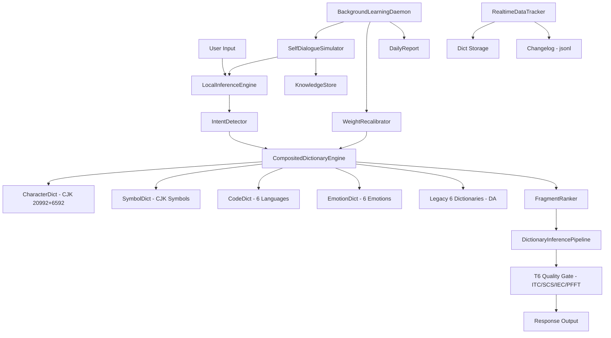

# 全字符字典自学习引擎

Feature Name: comprehensive-dictionary-engine
Updated: 2026-07-13

## Description

在现有 DictionaryAssembler（六本字典）+ LocalInferenceEngine（零API推理）+ AutoTrainer（后台学习）基础上，构建四组新字典（全量CJK汉字、中文符号标点、编程代码符号、6核心情感状态），新增自模拟对话循环，升级为无限持续后台学习管道。引擎在无外部LLM API条件下，自行从字典碎片组装回复，并通过自模拟对话自主进化。

## Architecture



## Components and Interfaces

### 1. CompositedDictionaryEngine (`src/cee/app/local_llm/composited_dict.py`)

统一的字典管理引擎，合并新四本字典与旧六本字典。

```python
class CompositedDictionaryEngine:
    character_dict: CharacterDictionary   # R1: CJK汉字
    symbol_dict: SymbolDictionary         # R2: 中文符号
    code_dict: CodeDictionary             # R3: 编程符号
    emotion_dict: EmotionDictionary       # R4: 6种情感
    legacy_da: DictionaryAssembler        # 旧有六本字典

    def query(intent: str, fragments: list[str]) -> list[DictFragment]:
    def assemble(fragments: list[DictFragment]) -> str:
    def recalibrate_weights():
```

**接口**: 被 `LocalInferenceEngine` 调用，替代原有 `DictionaryAssembler` 的直接调用。

### 2. CharacterDictionary (`src/cee/app/local_llm/dicts/character_dict.py`)

全量CJK汉字字典, 包含 Unicode 基础区 20992 字 + 扩展A区 6592 字。

- **存储**: 压缩二进制格式 (MessagePack), 懒加载, 每区一个文件
- **索引**: 部首笔画 + 拼音首字母 + UTF-8字节前缀 三层索引
- **元数据**: 每个汉字条目 = {char, unicode_codepoint, stroke_count, radical, semantic_embedding (64d float32), weight (float32), frequency_rank}
- **预估大小**: 27584 字 * 约 300 bytes/条 = ~8MB

### 3. SymbolDictionary (`src/cee/app/local_llm/dicts/symbol_dict.py`)

CJK符号与全角标点字典。

- **范围**: U+3000-U+303F (CJK Symbols), U+FF00-U+FFEF (Fullwidth), U+31C0-U+31EF (Strokes)
- **元数据**: {symbol, unicode_codepoint, category, ascii_equivalent (optional), usage_contexts: list[str]}
- **模糊匹配**: `_fuzzy_match("（") == "("` 支持中英括号互转

### 4. CodeDictionary (`src/cee/app/local_llm/dicts/code_dict.py`)

六语言编程符号+代码模式字典。

- **符号表**: Python/JS/C/Rust/Go/Bash 的运算符+关键字+内置函数 (~600条符号)
- **模式模板**: 100+模板 * 3~5变体 (~400条模式)
- **元数据**: {symbol, language, category (operator/keyword/builtin/pattern), rank_weight, context_examples: list[str], pattern_type (optional)}
- **模式示例**:
  ```python
  {
    "type": "sort",
    "variants": [
      {"lang": "python", "code": "sorted(data, key=lambda x: x[...])"},
      {"lang": "rust", "code": "data.sort_by(|a, b| a[...].cmp(&b[...]))"},
      ...
    ]
  }
  ```

### 5. EmotionDictionary (`src/cee/app/local_llm/dicts/emotion_dict.py`)

6种核心情感编码字典。扩展已有 `AffectEngine.EMOTION_PROFILES`, 加入更丰富的情感响应模板。

- **情感**: 好奇/困惑/沮丧/兴奋/疲惫/中性
- **元数据**: {emotion, intensity[0-1], keyword_triggers: list[str], tone_templates: list[str], transition_weights: dict[str, float]}
- **检测**: 关键词+否定词+句式模式三重匹配, 与已有 `AffectEngine` 集成

### 6. DictionaryInferencePipeline (`src/cee/app/local_llm/inference_pipeline.py`)

字典推理流水线, 编排从意图检测到回复生成的完整流程。

**流程**:
1. IntentDetector → 判定意图类别 (code/explain/emotion/logic/creative/translate/compare/chat)
2. CompositedDictionaryEngine.query() → 并行查10本字典, 取 top-20 碎片
3. FragmentRanker → 按相关性+新颖性+多样性排序
4. Assembler → 加权随机拼装碎片为回复
5. T6 Quality Gate → ITC/SCS/IEC/PFFT >= 0.65 才放行
6. 不达标则重试 (max 3次, 每次提高高权碎片比例+换组合模式)
7. 记录 assembly hash 去重 (LRU 2000)

### 7. SelfDialogueSimulator (`src/cee/app/local_llm/self_dialogue.py`)

自模拟对话生成器, 从字典随机种子生成提问并自答。

**种子策略**:
- 从 10 本字典中随机 pick 2-3 条作为种子
- 按种子类型选择 query 模板 (种子为代码符号 → 代码类 question, 种子为情感 → 情感咨询)
- 8种 query 类别: explain/code/emotion/logic/creative/translate/compare/chat
- 每个 query 确保不再于已生成历史(3000条LRU)中出现

**质量判断**: 生成的 query→response 对通过 T6 评估, composite >= 0.65 存入 KnowledgeStore, < 0.50 丢弃, 0.50-0.65 缓存待重试

### 8. BackgroundLearningDaemon (`src/cee/app/local_llm/learning_daemon.py`)

无限持续后台学习守护进程, 扩展已有 `AutoTrainer`。

**调度** (20分钟一轮):
- 10 min: 自模拟循环 (generating queries + evaluating + storing)
- 2 min: 去重裁剪 (prune max 5000 pairs)
- 3 min: 字典权重重校准 (recalibrate fragment weights by success rate)
- 5 min: 空闲冷却

**资源控制**: CPU > 70% 时暂停, < 30% 时恢复

### 9. RealtimeDataTracker (`src/cee/app/local_llm/data_tracker.py`)

实时数据持久化。

- **原子写入**: write temp file → os.rename (atomic on Linux)
- **变更日志**: `_changelog.jsonl` 每行一条 mutation: {ts, op, dict, key, old_val, new_val}
- **自动保存**: 每100次 assembly 或每60秒
- **快照**: 每日零时自动创建, 保留最近 7 天

## Data Models

```python
@dataclass
class DictEntry:
    key: str
    category: str                      # character/symbol/code/emotion/sentence/pattern/intent
    payload: dict                      # category-specific fields
    embedding: np.ndarray              # [64] float32
    weight: float                      # 全局权重 [0-1]
    created_at: float                  # epoch timestamp
    last_hit: float                    # 上次命中时间
    hit_count: int                     # 累计命中次数
    success_rate: float                # 组装后通过T6检查的比率

@dataclass
class SelfDialogueRecord:
    id: str
    simulated_query: str
    assembled_response: str
    itc: float; scs: float; iec: float; pfft: float
    composite: float
    tier: str
    seed_fragments: list[str]
    generated_at: str
    stored: bool                       # 是否存入KnowledgeStore

@dataclass
class ChangelogEntry:
    ts: str                            # ISO 8601
    op: str                            # add/update/remove
    dict_name: str                     # character/symbol/code/emotion/...
    key: str
    old_weight: Optional[float]
    new_weight: Optional[float]
```

## Correctness Properties

1. **无重复编码**: 每个 CJK Unicode codepoint 只在字典中存在一次, 插入前检查 key 唯一性
2. **组装历史去重**: 每次 assembled response 的 SHA-256 前 8 字节存入历史集合, 相同 hash 重试新组合
3. **原子持久化**: 所有文件写入使用 temp_file+rename 模式, 避免写入中断导致数据损坏
4. **懒加载安全**: 字典首次访问时才从磁盘加载, 加载期间持有模块级锁, 避免并发读脏数据
5. **T6 阈值硬约束**: 无 T6 检查的组装响应用户不可见, 三次重试后取最高分

## Error Handling

| 场景 | 处理 |
|------|------|
| 字典文件缺失 | 生成空字典骨架, Warning 日志, 不影响其他字典 |
| 碎片权重全为零 | Fallback 到 Legacy DictionaryAssembler 纯规则模式 |
| 自模拟质量连续低下 (>20次 < 0.50) | 暂停模拟, 进入"探索模式"(全随机 seed 组合) |
| CPU 持续 > 70% | 降低 daemon 轮次频率到原来的 1/4 |
| 磁盘空间不足 | 停止新的持久化写入, Warning 日志, 但不影响推理 |

## Test Strategy

1. **单元测试**: CharacterDictionary/SymbolDictionary/CodeDictionary/EmotionDictionary 各自的 insert/query/lazy_load 方法
2. **集成测试**: DictionaryInferencePipeline 端到端 (intent detect → query 10 dicts → rank → assemble → T6 gate)
3. **模拟测试**: SelfDialogueSimulator 100 轮循环, 验证多样性 (unique queries > 80%) 和平均质量 (avg composite > 0.60)
4. **持久化测试**: RealtimeDataTracker 写入/变更日志/快照恢复
5. **回归测试**: 确保现有 2002 个测试全部通过

## References

[^1]: DictionaryAssembler — `/workspace/src/cee/app/local_llm/dictionary_assembler.py`
[^2]: LocalInferenceEngine — `/workspace/src/cee/app/local_llm/local_inference.py`
[^3]: AutoTrainer — `/workspace/src/cee/app/local_llm/auto_train.py`
[^4]: KnowledgeStore — `/workspace/src/cee/app/local_llm/knowledge_store.py`
[^5]: AffectEngine — `/workspace/src/cee/app/local_llm/affect_engine.py`
